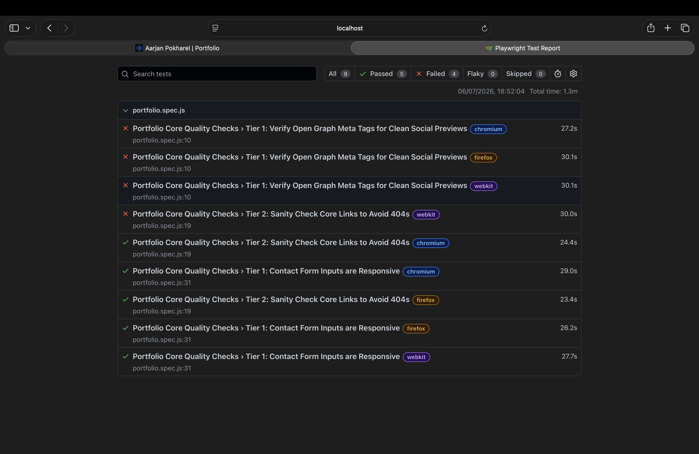

## **This repo is to test the personal portfolio "workwithaarjan.dev"**

To make sure everything looks flawless and functions perfectly before going live, we are breaking our testing down into two clear phases:

* **Manual Tests:** The human-eye pass. We are physically checking the site on *Chrome*, *Safari*, *an iPhone*, *an android* and *an iPad* to catch weird layout shifts, test keyboard navigation (Tab test), and proofread the text.

* **Automatic Tests:** The code infrastructure pass. We use scripts to automatically catch technical bugs like broken links, massive unoptimized images, console errors, and missing security attributes (rel="noopener").

## ✅ Phase 1: Manual Testing (Done)

I manually tested the website on **Chrome, Safari, iPhone, Android, and iPad**. 

### What I checked & verified:
* **Layouts:** Everything looks correct on desktop, mobile, and tablet screens.
* **Text:** All text wraps nicely and aligns perfectly without cutting off.
* **Buttons & Links:** All links go to the right places, and buttons work when clicked.
* **Keyboard Tab Test:** Navigating the site using the `Tab` key works perfectly.

## ✅ Phase 2: Automatic Testing (Done)

This contains an automated QA test suite built with **Playwright**. The goal is to run cross-browser infrastructure checks to make sure the portfolio looks professional, loads smoothly, and functions perfectly for recruiters.I perfomed the following tests for automatic tests:

### The tests:

* **Link Preview(Open Graph Tags):** This checks if the site has the hidden code needed to generate preview cards when shared.

✅ Pass: Looks clean and professional on LinkedIn, Slack, or WhatsApp.
❌ Fail: Renders as a boring, naked text link that doesn't invite clicks.

* **Broken Link Guard:** This simulates clicking the main buttons to ensure they aren't dead ends.

✅ Pass: Visitors can navigate smoothly everywhere.
❌ Fail: Visitors click a project or resume button and hit a **"404 Not Found"** error.

* **Contact Form Test:** Robot physically clicks and types in the contact box to make sure it isn't frozen.

✅ Pass: Anyone can easily type and send a message through the portfolio.
❌ Fail: The form locks up, blocking people from reaching out.

### How to perform this test:
1. Clone the repo and open it in the terminal
2. Install the dependencies and browser engines:

```bash
npm install
npx playwright install
```
3. Execute the test suite:

Run in the background: `npx playwright test`

Watch the browsers open live: `npx playwright test --headed`

View the interactive web report: `npx playwright show-report`

### What was found from the automatic test:


### 🔍 Quick Summary of the Screenshot Findings:
❌ Portfolio Core Quality Checks : Verify Open Graph Meta Tags for Clean Social Previews **Chromium**

❌ Portfolio Core Quality Checks : Verify Open Graph Meta Tags for Clean Social Previews **FireFox**

❌ Portfolio Core Quality Checks : Verify Open Graph Meta Tags for Clean Social Previews **webkit**

❌ Portfolio Core Quality Checks : Sanity Check Core Links to Avoid 404s **webkit**

✅ Portfolio Core Quality Checks : Sanity Check Core Links to Avoid 404s **Chromium**

✅ Portfolio Core Quality Checks : Sanity Check Core Links to Avoid 404s **FireFox**

✅ Portfolio Core Quality Checks : Contact Form Inputs are Responsive **FireFox**

✅ Portfolio Core Quality Checks : Contact Form Inputs are Responsive **Chromium**

✅ Portfolio Core Quality Checks : Contact Form Inputs are Responsive **WebKit**


* **Open Graph Link Previews:** ❌ **FAILED on all browsers.** The tags are completely missing under the hood. The site will not generate preview cards on social media.
* **Contact Form Check:** ✅ **PASSED on all browsers.** The inputs are active, fully responsive, and typeable everywhere.
* **Broken Link Guard:** ⚠️ **PARTIAL FAIL.** The links map perfectly fine on Chrome and Firefox, but hit a **30-second timeout freeze exclusively on Webkit (Safari)**. This tells us there is a major layout hang or a heavy, unoptimized file slowing down Apple devices.

**Next Steps:** Add the required social meta tags to the HTML header and investigate the performance bottleneck causing the script hang on Safari engines.